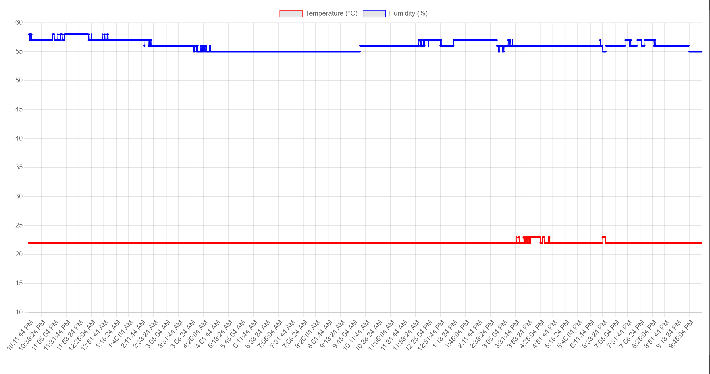

# [Introduction to the Internet of Things] Temperature reader
Goal: create a smart temperature reader that captures the temperature in a room and allows me to view the data in realtime from anywhere.

Chosen solution: A microcontroller/SBC with a temperature sensor, which reads the temperature at intervals and sends to a web server I set up. The web app stores the temperature readings and I can view at any time in its UI.

## Components used
- Microcontroller: [Raspberry Pi Pico WH](https://www.conrad.de/de/p/raspberry-pi-pico-wh-mikrocontroller-pico-wh-2825613.html). I went with the Pico model because I didn't need the full computing capabilities of the Pi line. I chose the WH variant for two reasons:
  - Wi-Fi connectivity [W] - It needs to send the temperature data over the network, and Wi-Fi is the simplest way to do that.
  - pre-soldered headers [H] - The headers are what you use to connect the chip to other devices, and I didn't want to do any soldering.
- Temperature sensor: DHT11 [from Joy-IT](https://www.conrad.de/de/p/joy-it-sen-ky015tf-temperatur-feuchtigkeitssensor-1-st-1695379.html)
- Breadboard and jumper cables for connecting the components
- RGB LED. Not required, but I added this later because it's nice to have a visual indicator, and it helps with observability.
I used [this](https://www.amazon.de/dp/B07V6YSGC9?ref=ppx_yo2ov_dt_b_fed_asin_title&th=1) from AZDelivery.


## Procedure
1. As this was my first time with a microcontroller, I first needed to set up my environment and get familiar with the chip. I followed [the official Getting Started tutorial](https://projects.raspberrypi.org/en/projects/get-started-pico-w), which guided me in loading it with the correct firmware (MicroPython), configuring my environment (installing the Thonny IDE) and running some test programs. 
2. Next, I connected the chip to the temperature sensor via the breadboard and jumper cables. This was fairly straightforward, as I already had previous knowledge of breadboards. The important step was to follow the directions provided by the sensor manufacturer (the manual detailed how to connect it to a Pico). I also double-checked the Pico's pinout diagram (a diagram showing the names of each pin, as they aren't always visible on the Pico).
3. Then I wrote a basic program on the microcontroller (connected to my PC via USB), which focused on reading from the sensor and connecting to my home Wi-Fi. The sensor manual had a sample program, and I found the `picozero` library documentation helpful too. I tested it by running it on the microcontroller from my machine; this helped me get familiar with what to expect.
4. After that, I built and deployed the API to receive temperature readings, store and render them, a simple Node.js server ([source code](https://github.com/shalvah/mercury)).
5. I went back to finish the program by having it send the temperature readings to the API server.
6. When all was working, I saved it to the Pico as `main.py`, so it runs whenever the chip is plugged in. After testing some more, I disconnected it from my PC and plugged it into a persistent power supply, and now it runs by itself. 

## Code

```python
import network
import machine
import requests
import ntptime
from picozero import pico_led, RGBLED
from time import sleep, time
from dht import DHT11

class WiFiConnectionTimeout(Exception):
    pass

# States and indicator colours:
# 1. Starting up - blink white
# 2. Connecting to WiFi - blink blue
# 3. WiFi connection failed - no light (restarts the Pico, and it should hopefully work)
# 4. WiFi connection successful - no light (transient state)
# 5. Most recent data read and sent successfully - blink green (happy path, normal operation)
# 6. Most recent data failed to send - blink red
# 7. Three consecutive failures - permanent red
# 8. Some other error - permanent blue (weird, I know, but for clarity)
def connect(led):
    led.blink(on_times=(0.5,0.5), colors=((0,0,1),(0,0,0)))
    wlan = network.WLAN(network.STA_IF)
    wlan.active(True)
    ssid = "..."
    password = "..."
    print(f"Connecting to {ssid}")
    wlan.connect(ssid, password)
    attempts = 0
    
    while not wlan.isconnected():
        attempts += 1
        print("Waiting for connection...")
        sleep(1)
        if attempts > 10:
            raise WiFiConnectionTimeout("Gave up on WiFi")
    
    print(wlan.ifconfig())
    led.off()
    
def send_reading(temperature, humidity, timestamp):
    url = f"https://..."
    response = requests.post(url, headers={"Authorization": "..."})
    print("Response code: {}".format(response.status_code))
    response.close()
    return response.status_code == 201
    
def run(sensor, led):
    ntptime.settime() # Sync time so timestamps are correct

    failures = 0
    while True:
      sensor.measure()
      temp = sensor.temperature()
      humidity = sensor.humidity()
      succeeded = send_reading(temp, humidity, round(time()))
      if not succeeded:
          led.blink(colors=((1,0,0),(0,0,0)))
          failures += 1
          if failures >= 3:
              led.red = 255
              break
      else:
          led.blink(colors=((0,1,0),(0,0,0)))
          failures = 0
      
      sleep(30) # Can only be read once per second, but 1/30 is enough for us

indicator = RGBLED(red=13, green=12, blue=11)
indicator.blink(colors=((1,1,1),(0,0,0))) # White = starting up
sleep(4)

temp_sensor = DHT11(machine.Pin(14, machine.Pin.IN, machine.Pin.PULL_UP))

try:
    connect(indicator)
except WiFiConnectionTimeout:
    machine.reset() # This basically restarts the Pico

try:
    run(temp_sensor, indicator)
except Exception:
    indicator.blue = 255
    raise
```

## Results
After a day of recording:




## Challenges
- **Powering the Pico**: In the initial phases, the chip was plugged in to my PC, but I needed an always-on solution, 
while taking note of the Pico's power requirements, as specified in its datasheet.
Eventually, I simply plugged it into an extension box with USB slots I had lying around.
Another option is to get a dedicated power supply, such as [this](https://www.amazon.de/dp/B0CF44S2HG?ref=ppx_yo2ov_dt_b_fed_asin_title).
- **Interrupting `main.py`**: Since `main.py` always runs on startup, if you have an infinite loop (read data - send - repeat),
it becomes hard to interrupt this. I was unable to edit the program or run any new programs via Thonny.
Eventually I had to upload a new firmware that deleted all files on the chip, then reupload the MicroPython firmware and start again.
My eventual solution was to add a 5-second delay before entering the loop, which gives me enough time to interrupt via Thonny.
- **Wi-Fi connection failures or other interruptions**: When I interrupted the program on my PC, 
it would sometimes fail to connect to Wi-Fi afterwards. I never totally solved this, 
but added a redundancy feature to restart the chip after a while.
I also assigned each possible state a colour in the indicator LED, so I could tell at a glance if something was wrong.
- **Memory leaks**: A minor problem was running into an "ENOMEM" (out of memory error) after two HTTP requests. 
The solution to this was adding `response.close()` after each request.
- **Time**: The Pico's onboard clock seems to always start from 1 Jan 2021, 
so I added some code to resynchronize it from an NTP server on each restart.
- **Visibility**: The chip is an opaque, limited system, so it can be quite hard to know what's going on when it's not connected to Thonny.
To improve this, I added an indicator RGB LED that could take on different colours to indicate problems vs normal operation.
- **Accuracy**: The DHT11 sensor only gives integral values, and with a precision of ±2 degrees, so the data isn't very reliable.

## Improvements
- **Handling and indicating more error states**: For instance, too many failed network requests could turn the LED red.
A failed Wi-Fi connection could cause it to flash red.  
- **Informational lighting**: I could also use a LED to indicate when the temperature goes above or below threshold
- **Automatic control**: I could connect this to my thermostat with an actuator to regulate the temperature.